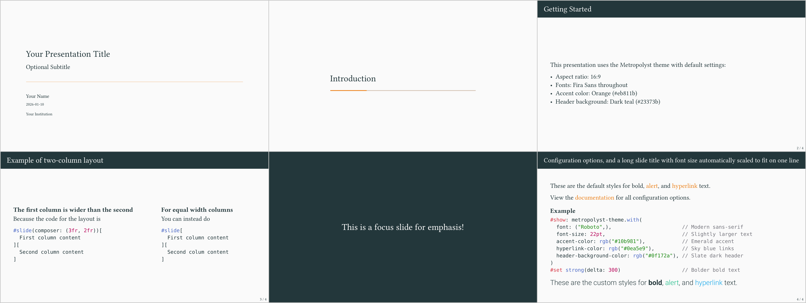

# Metropolyst

A highly configurable Metropolis-style presentation theme. Originally based on the [Metropolis beamer theme](https://github.com/matze/mtheme), Metropolyst provides extensive font and color customization options.



## Implementations

| Version | Status | Installation |
|---------|--------|--------------|
| [**Typst**](typst/) | Published | `typst init @preview/metropolyst:0.1.0` |
| [**Quarto**](quarto/) | In development | `quarto add benzipperer/metropolyst/quarto` |

## Quick Start

### Typst (Native)

```typst
#import "@preview/metropolyst:0.1.0": metropolyst-theme, brands

#show: metropolyst-theme.with(
  config-info(
    title: [Your Title],
    author: [Your Name],
    date: datetime.today(),
  ),
)

#title-slide()

= Section Title

== Slide Title

Your content here...
```

See [typst/README.md](typst/README.md) for full documentation.

### Quarto

```yaml
---
title: "Your Title"
author: "Your Name"
format:
  metropolyst-typst:
    accent-color: "#eb811b"
---

## Slide Title

Your content here...
```

See [quarto/README.md](quarto/README.md) for full documentation (coming soon).

## Features

- Configurable fonts (22 font options)
- Configurable colors (12 color options)
- Brand presets for organizational styling
- Multiple slide types: title, content, section, and focus slides
- Progress bar support
- 16:9 and 4:3 aspect ratios

## Credits

- Based on [Matthias Vogelgesang's Beamer Metropolis theme](https://github.com/matze/mtheme)
- Built on the [Touying](https://github.com/touying-typ/touying) presentation framework
- Inspired by the [Touying Metropolis theme](https://touying-typ.github.io/docs/themes/metropolis/) by @Enivex

## License

MIT License. See [LICENSE](LICENSE) for details.
